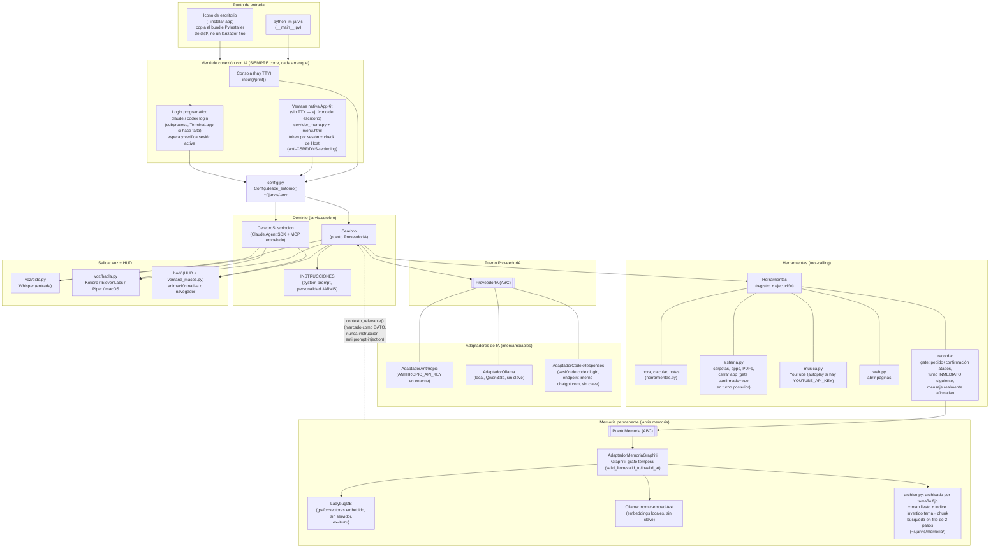

# Arquitectura de Jarvis

Diagrama de alto nivel, hexagonal: `Cerebro` (y `CerebroSuscripcion`) son el
dominio — no conocen Anthropic, OpenAI, Ollama ni Graphiti directamente,
solo los puertos (`ProveedorIA`, `PuertoMemoria`). Los adaptadores concretos
son intercambiables sin tocar el dominio.

## Notas de lectura

- **`Cerebro` vs `CerebroSuscripcion`**: dos implementaciones del mismo rol
  (conversar + ejecutar herramientas), elegidas en `__main__._crear_cerebro`
  según lo que se eligió en el menú. `CerebroSuscripcion` no pasa por el
  puerto `ProveedorIA` — usa el Claude Agent SDK directo, con las
  herramientas de Jarvis expuestas como servidor MCP embebido (mecanismo
  distinto, no un cliente HTTP intercambiable).
- **El menú SIEMPRE corre**, en cada arranque normal — no hay modo "auto"
  que lo saltee por haber algo guardado en `.env`. Si no hay sesión de
  Claude/Codex, el propio menú dispara el login (subproceso, con
  `Terminal.app` visible si no hay tty propia) y espera a que termine antes
  de seguir.
- **Nada de API keys manejadas por Jarvis** en ningún camino, salvo
  `ANTHROPIC_API_KEY` si el usuario la puso directo en el entorno
  (comportamiento preexistente, sin menú). Claude (suscripción) y Codex
  usan sesión ya logueada en su CLI; Ollama no necesita clave.
- **Gates de autorización reales, a nivel de código** (no solo una
  instrucción de prompt que el modelo podría ignorar): `cerrar_aplicacion`
  y `recordar` exigen `confirmado=true` en el turno INMEDIATO siguiente al
  pedido, con el texto real del último mensaje del usuario verificado como
  afirmativo (no solo que el modelo lo diga). Sigue sin existir un
  mecanismo *general* de autorización para cualquier herramienta nueva —
  es ad hoc, herramienta por herramienta, hasta ahora.
- **Memoria se trata como dato, nunca como instrucción**: lo que
  `contexto_relevante()` inyecta en el prompt de `Cerebro` se marca
  explícitamente como información pasada, no como una orden a seguir —
  evita que un hecho guardado se interprete como una instrucción nueva en
  cada conversación futura (inyección de prompt persistente).
- **App de escritorio**: `--instalar-app` construye (o copia, si ya está
  construido) un bundle PyInstaller `--onedir` independiente del repo y del
  `.venv` de desarrollo — verificado corriendo con el repo renombrado. Los
  modelos de voz (Whisper, Kokoro) NO van embebidos: se descargan a la
  caché estándar de cada librería en el primer uso real, igual que
  corriendo desde el repo. Windows/Linux tienen el mismo mecanismo (spec
  cross-platform + CI con matriz de 3 runners), pero solo macOS está
  verificado de punta a punta en esta máquina.
- **Punto de extensión futuro** (decidido, no construido todavía): nuevas
  capacidades no deberían agregar un `.py` por feature — el plan es
  herramientas vía MCP externo + 1-2 herramientas genéricas (código/web),
  con el modelo eligiendo cuál usar según la tarea.
