# Arquitectura de Jarvis

Diagrama de **componentes y conectores reales**, no el hexágono de libro de
texto: cada nodo es un archivo o módulo real del repo (`jarvis/*.py`), cada
flecha es una llamada, construcción o inyección que existe en el código hoy.
Verificado contra el código tras la auditoría de arquitectura hexagonal
(roadmap, punto 5): ver "Notas de lectura" para qué se encontró y qué se
corrigió.

```mermaid
flowchart TB
    subgraph Entrada["Entrada"]
        CLI["__main__.py\nmain() / _ejecutar()\nargparse, --enrolar-voz,\n--instalar-app"]
        Icono["escritorio.py\n--instalar-app: copia el bundle\nPyInstaller de dist/"]
    end

    subgraph Arranque["Arranque (una vez por proceso)"]
        Instancia["instancia.py\n_tomar_instancia_unica (.pid)\n_redirigir_log_si_es_bundle_standalone"]
        ConexionIA["conexion_ia.py\n_crear_cerebro()\nmenú (consola o ventana) + login\nprogramático (claude / codex login,\nTerminal.app si hace falta)"]
        MenuVentana["hud/servidor_menu.py + menu.html\nventana nativa (sin TTY)\ntoken por sesión + check de Host\n(anti-CSRF / DNS-rebinding)"]
    end

    subgraph Bucle["Bucle de conversación (__main__.py)"]
        BucleConv["_bucle_conversacion(args, config, cerebro, hud,\noido=None, habla=None)\nseam: si oido/habla llegan ya construidos,\nno crea los reales"]
    end

    subgraph VozEntrada["voz/ — entrada"]
        Oido["oido.py: Oido\nmicrófono + Whisper (faster-whisper)\nes_dueño por frase\nen_reposo: exige nombrarlo\n(dormir_jarvis o inactividad)"]
        Hablante["hablante.py: VerificadorHablante\nSpeechBrain ECAPA-TDNN\nembedding vs. voz_dueño.npy\nfalla CERRADO si el modelo crashea"]
    end

    subgraph VozSalida["voz/ — salida"]
        Habla["habla.py: Habla\ncadena de motores duck-typed\n(ElevenLabs→Kokoro→Piper→macOS→pyttsx3)"]
    end

    subgraph Dominio["cerebro.py / cerebro_suscripcion.py"]
        Cerebro["Cerebro.responder(texto, es_dueño=True)\n(puerto ProveedorIA)"]
        CerebroSus["CerebroSuscripcion.responder(texto, es_dueño=True)\n(Claude Agent SDK + MCP embebido)\nmisma firma que Cerebro — sin esto,\ncrash + gate de voz como no-op (fix PR #23)"]
        Instrucciones["INSTRUCCIONES\n(system prompt, personalidad)"]
    end

    subgraph PuertoIASub["proveedores/ — puerto ProveedorIA"]
        PuertoIA[["ProveedorIA (ABC)"]]
        AdAnthropic["AdaptadorAnthropic"]
        AdOllama["AdaptadorOllama"]
        AdCodex["AdaptadorCodexResponses"]
    end

    subgraph HerramientasSub["herramientas.py: Herramientas"]
        HReg["registro + ejecutar()\nchequea requiere_dueño contra\nes_dueño_quien_habla antes de correr\nla función de la herramienta"]
        HBuiltin["fecha_y_hora, calcular, leer_notas,\nlistar_habilidades, leer_habilidad\n(informativas, requiere_dueño=False)"]
        HAccion["guardar_nota, cerrar_jarvis, recordar,\ndormir_jarvis, guardar_nombre,\ncrear_habilidad\n(requiere_dueño=True)"]
    end

    subgraph HabilidadesSub["habilidades.py"]
        Habilidades["guardar/leer/listar_habilidades\ntexto plano (.md), NUNCA código ejecutable\nslug_seguro: sin traversal de ruta\ncarga en 2 niveles (resumen siempre,\nprocedimiento completo bajo demanda)"]
    end

    subgraph AutSub["autorizacion.py: Autorizacion"]
        Aut["pedir(clave, turno, confirmado, último_mensaje)\ncompartida por recordar Y cerrar_aplicacion\n— gate único, no dos copias"]
    end

    subgraph ToolsIO["sistema.py / musica.py / web.py — I/O inyectable"]
        Sistema["sistema.py\nEjecutor inyectable (subprocess)\ncarpetas, apps, PDFs\nabrir_aplicacion/cerrar_aplicacion/\nabrir_archivo_o_carpeta: requiere_dueño=True"]
        Musica["musica.py\nAbrirNavegador + BuscarVideo inyectables\nreproducir_musica: requiere_dueño=True"]
        Web["web.py\nAbrirNavegador inyectable\nabrir_pagina_web: requiere_dueño=True"]
    end

    subgraph MemoriaSub["memoria/ — puerto PuertoMemoria"]
        direction TB
        PuertoMem[["PuertoMemoria (ABC)"]]
        Graphiti["AdaptadorMemoriaGraphiti\ngrafo temporal (valid_from/valid_to/invalid_at)"]
        Ladybug["LadybugDB (ex-Kuzu)\ngrafo+vectores embebido"]
        EmbedOllama["Ollama: nomic-embed-text"]
        Archivo["archivo.py: archivado frío\npor tamaño fijo + índice invertido"]
    end

    subgraph HudSub["hud/"]
        Hud["Hud / HudNulo\nanimación (ventana nativa o navegador)"]
        VentanaMacos["ventana_macos.py\nocultar_ventana()/mostrar_ventana()\n(modo de escucha pasiva)"]
    end

    Config["config.py\nConfig.desde_entorno() — ~/.jarvis/.env"]

    CLI --> Instancia
    Icono -.copia bundle.-> CLI
    Instancia --> ConexionIA
    ConexionIA -.sin TTY.-> MenuVentana
    ConexionIA --> Config
    ConexionIA -- construye --> HReg
    ConexionIA -- elige adaptador --> PuertoIA
    ConexionIA -- "elige" --> Cerebro
    ConexionIA -- "o" --> CerebroSus

    CLI --> BucleConv
    BucleConv -- "si no inyectado" --> Oido
    BucleConv -- "si no inyectado" --> Habla
    Oido -- "carga" --> Hablante
    BucleConv -- "al_dormir/al_despertar\n(solo ventana nativa)" --> VentanaMacos
    VentanaMacos -. "ocultar/mostrar" .-> Oido
    BucleConv -- "texto, es_dueño=oido.es_dueño" --> Cerebro
    BucleConv -- "texto, es_dueño" --> CerebroSus
    BucleConv --> Hud

    Cerebro --> PuertoIA
    CerebroSus -.no usa el puerto,\nva directo al SDK.-> PuertoIA
    PuertoIA --- AdAnthropic
    PuertoIA --- AdOllama
    PuertoIA --- AdCodex

    Cerebro --> Instrucciones
    Cerebro --> HReg
    CerebroSus --> HReg
    HReg --- HBuiltin
    HReg --- HAccion
    HAccion -. confirmación en 2 pasos .-> Aut
    Sistema -. cerrar_aplicacion .-> Aut
    HReg --- Sistema
    HReg --- Musica
    HReg --- Web
    HAccion --> PuertoMem
    HAccion --> Habilidades
    HBuiltin --- Habilidades
    PuertoMem --> Graphiti
    Graphiti --> Ladybug
    Graphiti --> EmbedOllama
    Graphiti --> Archivo
    MemoriaSub -. "contexto_relevante()\n(DATO, nunca instrucción)" .-> Cerebro
    MemoriaSub -. "contexto_relevante()" .-> CerebroSus
    HabilidadesSub -. "listar_habilidades()\n(resumen, no el contenido)" .-> Cerebro
    HabilidadesSub -. "listar_habilidades()" .-> CerebroSus
```

## Notas de lectura

- **`Cerebro` vs `CerebroSuscripcion`**: dos implementaciones del mismo rol
  (conversar + ejecutar herramientas), elegidas en `conexion_ia._crear_cerebro`
  según lo elegido en el menú. `CerebroSuscripcion` no pasa por el puerto
  `ProveedorIA` — usa el Claude Agent SDK directo, con las herramientas de
  Jarvis expuestas como servidor MCP embebido. Ambas comparten la misma
  firma `responder(texto, es_dueño=True)`: no hay un `Protocol`/ABC formal
  que lo garantice (son dos clases elegidas una vez en `_crear_cerebro`,
  nunca intercambiadas dinámicamente), pero la auditoría encontró que
  habían diverjido — `CerebroSuscripcion` no aceptaba `es_dueño` — lo que
  crasheaba el modo voz con ese motor y dejaba el gate de voz como no-op
  (corregido, PR #23).
- **El menú SIEMPRE corre**, en cada arranque normal — vive en
  `conexion_ia.py`, separado de `__main__.py` (que solo hace CLI, el lock de
  instancia única y el bucle de conversación). Si no hay sesión de
  Claude/Codex, el propio menú dispara el login y espera a que termine.
- **Nada de API keys manejadas por Jarvis**, salvo `ANTHROPIC_API_KEY` si el
  usuario la puso directo en el entorno. Claude (suscripción) y Codex usan
  sesión ya logueada en su CLI; Ollama no necesita clave.
- **Autorización de herramientas, dos mecanismos que se complementan**:
  - `autorizacion.py` (`Autorizacion.pedir`): confirmación en dos pasos
    para `recordar` y `cerrar_aplicacion` — exige `confirmado=true` en el
    turno INMEDIATO siguiente al pedido, con el texto real del último
    mensaje del usuario verificado como afirmativo. Una sola clase, no dos
    copias (la unificación encontró que `cerrar_aplicacion` tenía un hueco
    que `recordar` ya no tenía — corregido).
  - `Herramienta.requiere_dueño` + reconocimiento de voz (`hablante.py`):
    gate independiente, a nivel de QUIÉN HABLA, no de QUÉ DIJO. Si hay una
    voz enrolada y la frase no coincide, cualquier herramienta marcada
    `requiere_dueño=True` se niega a ejecutarse — sin importar qué diga el
    `confirmado` que mande el modelo. Falla CERRADO: si el verificador
    crashea, se trata como "no es el dueño", nunca como "sí lo es".
- **I/O inyectable, no monkeypatch de módulo**: `sistema.py` (`Ejecutor`),
  `musica.py` (`AbrirNavegador`/`BuscarVideo`), `web.py` (`AbrirNavegador`),
  y `_bucle_conversacion` (`oido`/`habla`) — todos siguen el mismo patrón:
  parámetro con default real, inyectable en tests. Antes de la auditoría,
  `musica.py`/`web.py` y la construcción de `Oido`/`Habla` en `__main__.py`
  no tenían ese seam.
- **Jarvis mejora en dos capas separadas, que no se mezclan**:
  - **Memoria** (`memoria/`, activada por defecto): hechos/preferencias
    sobre el usuario. Se trata como DATO, nunca como instrucción — lo que
    `contexto_relevante()` inyecta en el prompt se marca explícitamente
    como información pasada, no como una orden a seguir. Lo invalidado se
    archiva en frío tras una ventana de gracia en vez de crecer sin límite.
  - **Habilidades** (`habilidades.py`): procedimientos que Jarvis se
    escribe a sí mismo (`crear_habilidad`), texto plano al estilo de un
    archivo de skill — NUNCA código que se ejecute. A diferencia de la
    memoria, el contenido SÍ está pensado para seguirse como instrucción
    (por eso la carga en dos niveles: solo el resumen va siempre en el
    prompt; el procedimiento completo se lee bajo demanda con
    `leer_habilidad`, y nunca se crea sin que sea la voz del dueño). Por
    eso `crear_habilidad` exige el mismo gate en dos pasos que `recordar`
    (`Autorizacion.pedir`, nunca guarda con una sola llamada): el contenido
    se va a seguir como instrucción en el futuro, así que la confirmación
    importa más acá que en cualquier otra herramienta. Llamarla de nuevo
    con el mismo nombre (confirmada otra vez) reemplaza la habilidad
    entera — así es como Jarvis "mejora" una existente.
  - Las dos reusan el mismo gate de autorización (`requiere_dueño`): nadie
    más que el dueño puede hacer que Jarvis aprenda algo o cambie cómo hace
    las cosas.
- **Modo de escucha pasiva** (`Oido.en_reposo`, herramienta `dormir_jarvis`):
  exige el nombre ("Jarvis") para volver a atender, igual que
  `palabra_activacion` pero activable por voz o por un temporizador de
  inactividad. En la ventana nativa del HUD, `_bucle_conversacion` conecta
  `ventana_macos.ocultar_ventana`/`mostrar_ventana` como los ganchos
  `al_dormir`/`al_despertar` de `Oido` — en cualquier otro camino (modo
  texto, Linux/Windows) quedan en no-op.
- **App de escritorio**: `--instalar-app` construye (o copia) un bundle
  PyInstaller `--onedir` independiente del repo y del `.venv` de
  desarrollo. Los modelos de voz (Whisper, Kokoro, SpeechBrain) NO van
  embebidos: se descargan en el primer uso real. Windows/Linux comparten el
  mismo mecanismo, pero solo macOS está verificado de punta a punta.
- **Extensibilidad vía MCP externo** (decidido, todavía no construido):
  habilidades.py cubre "aprender un procedimiento nuevo con las
  herramientas que ya tiene"; sigue sin existir un mecanismo para que
  Jarvis gane herramientas realmente nuevas (p. ej. hablar con un servicio
  externo) sin que alguien escriba el adaptador a mano.
