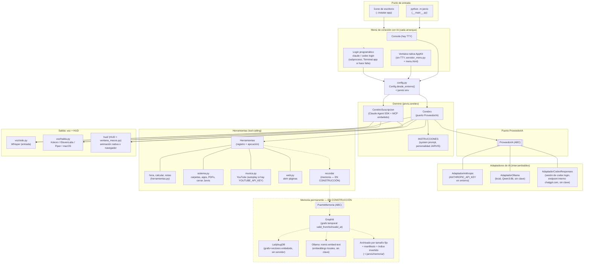

# Arquitectura de Jarvis

Diagrama de alto nivel, hexagonal: `Cerebro` (y `CerebroSuscripcion`) son el
dominio — no conocen Anthropic, OpenAI, Ollama ni Graphiti directamente,
solo los puertos (`ProveedorIA`, `PuertoMemoria`). Los adaptadores concretos
son intercambiables sin tocar el dominio.

## Notas de lectura

- **Líneas punteadas** = en construcción (memoria permanente) o dependencia
  opcional/condicional (login disparado solo si hace falta).
- **`Cerebro` vs `CerebroSuscripcion`**: dos implementaciones del mismo rol
  (conversar + ejecutar herramientas), elegidas en `__main__._crear_cerebro`
  según `Config.motor`. `CerebroSuscripcion` no pasa por el puerto
  `ProveedorIA` — usa el Claude Agent SDK directo, con las herramientas de
  Jarvis expuestas como servidor MCP embebido (mecanismo distinto, no un
  cliente HTTP intercambiable).
- **Nada de API keys manejadas por Jarvis** salvo `ANTHROPIC_API_KEY` si el
  usuario la puso directo en el entorno (comportamiento preexistente, sin
  menú). Claude (suscripción) y Codex usan sesión ya logueada en su CLI;
  Ollama no necesita clave.
- **Punto de extensión futuro** (decidido, no construido todavía): nuevas
  capacidades no deberían agregar un `.py` por feature — el plan es
  herramientas vía MCP externo + 1-2 herramientas genéricas (código/web),
  con el modelo eligiendo cuál usar según la tarea.
